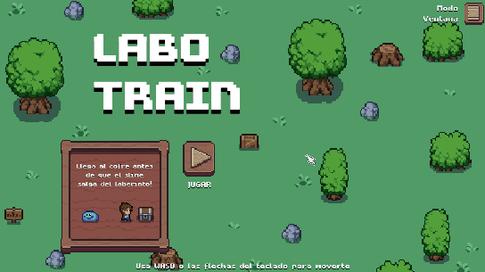
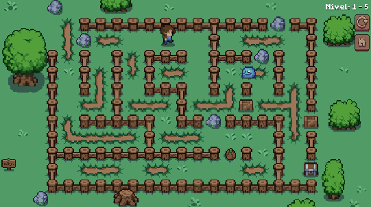

# LaboTrain 🧩

Desarrollo de un juego donde se modela y emplean técnicas de Inteligencia Artificial.

## Planteamiento del Juego 🎮

Descarga el [ejecutable de LaboTrain](https://github.com/FrowsyFrog/LaboTrain/releases/download/1.0.0/LaboTrain.1.0.0.zip)

Enfrentate en una carrera contra una inteligencia artificial dentro de 5 laberintos generados proceduralmente. Usa WASD o las flechas del teclado para mover a tu personaje para llegar hasta el cofre. Si el slime llega a salir del laberinto antes que lo logres, perderás.

## Cómo editar el proyecto

La aplicación fue realizada en el motor de videojuegos Unity, en su versión 2021.3.0f1. Por lo que será necesario esta versión o una posterior si desea abrirlo desde el motor.

Para ello, usted deberá:

1. Descargar el repositorio.
1. Ejecutar Unity Hub.
2. Hacer clic en abrir proyecto.
3. Buscar y abrir la carpeta del repositorio.
   
Después de ello podrá ejecutar el proyecto con tranquilidad.

### Leer proyecto sin hacer uso de Unity
Si desea solo revisar los archivos sin hacer uso del motor Unity, entre a la carpeta [Assets](Assets/), allí encontrará cada apartado separado en su carpeta respectiva, desde el arte utilizado hasta el código del juego.

## Licencia

Lee la [licencia](LICENSE).